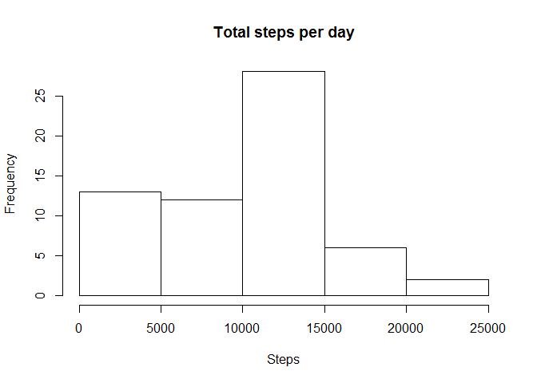
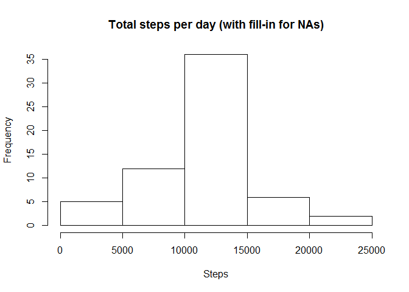
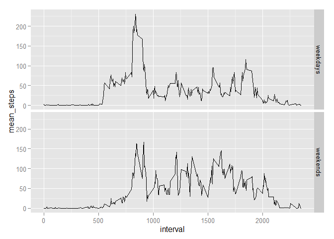

# Reproducible Research: Peer Assessment 1


## Loading and preprocessing the data
The data is loaded in a data.frame named "mydata."

```r
DIR_NAME <- "D:/Documents/R_Coursera/RepData_PeerAssessment1/activity"
FILE_NAME <- "activity.csv"
PATH <- paste(DIR_NAME, FILE_NAME, sep = "/")
mydata <- read.csv(PATH, header = TRUE, na.strings = "NA")
```


## What is mean total number of steps taken per day?
First, calculate the total number of steps taken per day.


```r
steps_day <- split(mydata$steps, mydata$date)
sums <- unlist(lapply(steps_day, sum, na.rm = TRUE))
```

Then, make a histogram.

```r
hist(sums, main = "Total steps per day", xlab = "Steps")
```

 

Finally, calculate mean and median.

```r
mean(sums); median(sums)
```

```
## [1] 9354.23
```

```
## [1] 10395
```

## What is the average daily activity pattern?
The "split-apply" grammer is useful here again.  
First calculate means across dates for each interval and search for the maximum.

```r
means_within_day <- unlist(lapply(split(mydata$steps, mydata$interval), 
                           mean, na.rm = TRUE))
```

The x vector for the required plot is stored in the attributes of this variable.

```r
plot(unlist(attributes(means_within_day)), means_within_day, type = "l",
     xlab = "Interval", ylab = "Steps")
```

 

Finally, calculate the maximum.

```r
means_within_day[which.max(means_within_day)]
```

```
##      835 
## 206.1698
```


## Imputing missing values
### 1. total number of missing values


```r
sum(is.na(mydata$steps))
```

```
## [1] 2304
```

### 2. Fill in the missing values
Here I will fill in the average values of that interval within the day.
It would make sense to assume that at the same time of the day the number of steps would be similar.  
For this purpose, first replicate the mean vector by the number of date, then 
fill in using ifelse function. Vectorization is utilized here.

```r
fill_in <- rep(means_within_day, length(unique(mydata$date)))
mydata2 <- mydata
mydata2$steps <- ifelse(is.na(mydata2$steps), fill_in, mydata2$steps)
any(is.na(mydata2$steps))
```

```
## [1] FALSE
```
### 3. Create a new dataset
It is already created as mydata2  

### 4. A new histogram
The procedure is quite same as in above.

```r
steps_day2 <- split(mydata2$steps, mydata2$date)
sums2 <- unlist(lapply(steps_day2, sum, na.rm = TRUE))
hist(sums2, main = "Total steps per day (with fill-in for NAs)", xlab = "Steps")
```

 

You can see how important it is to address NAs!
Now it looks more normal.

## Are there differences in activity patterns between weekdays and weekends?
### 1. Create a new column indicating weekdays/weekends
First, "date" is converted into POSIX format. Then, a new column is added.

```r
mydata2$POSIX <- as.POSIXlt(mydata2$date)
Sys.setlocale("LC_TIME", "English")     # From Japanese to Englich
```

```
## [1] "English_United States.1252"
```

```r
mydata2$weekday <- ifelse((weekdays(mydata2$POSIX) == "Saturday"
                           | weekdays(mydata2$POSIX) == "Sunday"), 
                          "weekends", "weekdays"
                          )
```

### 2. Make a panel plot
Use packages "dplyr" and "ggplot2" here.

```r
library(dplyr)
```

```
## 
## Attaching package: 'dplyr'
## 
## The following object is masked from 'package:stats':
## 
##     filter
## 
## The following objects are masked from 'package:base':
## 
##     intersect, setdiff, setequal, union
```

```r
mydata2$POSIX <- NULL  # POSIX datatype is unacceptable in group_by function
means_wd_wn <- summarize(group_by(mydata2, weekday, interval), mean(steps))
colnames(means_wd_wn)[3] <- "mean_steps" # Original column name is "mean(steps)"
library(ggplot2)
p <- ggplot(means_wd_wn, aes(interval, mean_steps)) + geom_line()
p + facet_grid(weekday ~ .)
```

 
